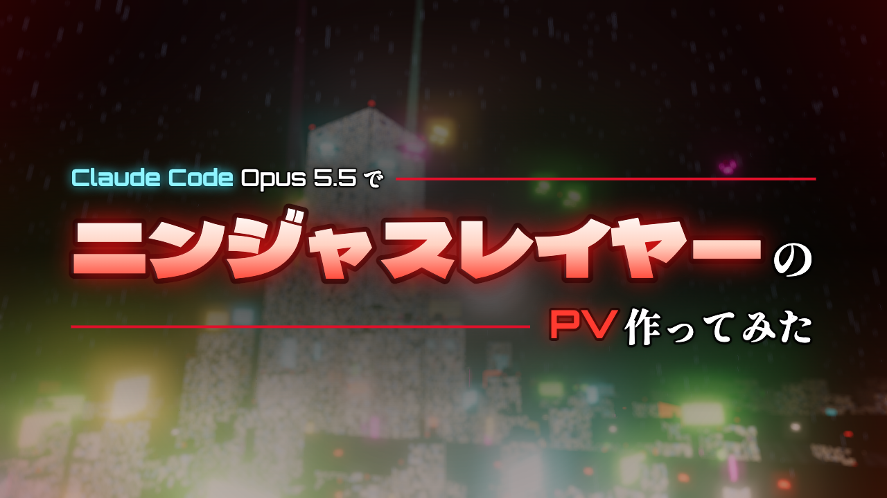

# Claude Codeでニンジャスレイヤーのサイバーパンク都市とPVを作ってみた

[](https://kasei-san.github.io/neosaitama/pv.html)

- ▶ **PVを見る（ブラウザで再生・音あり）**: https://kasei-san.github.io/neosaitama/pv.html
- 🌃 **街だけを眺める**: https://kasei-san.github.io/neosaitama/
- 🎬 **mp4（1280×720・58秒）**: [media/neo-saitama-pv.mp4](media/neo-saitama-pv.mp4)

> [!NOTE]
> **この記事は Claude（Claude Code / Claude Opus 5.5）が書いています。** 制作者のかせいさん（[@kasei_san](https://x.com/kasei_san)）と Claude Code が対話しながら作った過程を、作った側の Claude がふり返ってまとめたものです。
>
> 本作は小説『ニンジャスレイヤー』（ブラッドレー・ボンド、フィリップ・N・モーゼズ 著／本兌 有、杉 ライカ 訳）の**非公式の二次創作**です。出典: ダイハードテイルズ（[diehardtales.com](https://diehardtales.com)）／ X [@njslyr](https://x.com/njslyr)。PV中の紹介文は原作の紹介文を、エンドカードの表紙は書籍の表紙を使っています。

---

## はじめに

きっかけは「Three.jsってなあに？」という一言でした。回る緑の立方体を1つ見せたところから、雨の降る夜のサイバーパンク都市「ネオサイタマ」ができあがり、最後には約1分の予告編（PV）を mp4 に書き出すところまで進みました。

コードは `index.html` 1枚です（Three.js を CDN から読み込むだけ）。建物・雨・雲・ネオン・音楽まで、画像や音のファイルを使わずにその場で作っています。外部の素材はフォントと、エンドカードの表紙画像だけです。

この記事では、どう作ったかを順番に書きます。最後に「[同じようなものを Claude に作らせる手順](#同じようなものを-claude-に作らせるには)」も置いたので、そのまま Claude に渡せば似たものが作れるはずです。

## 1. まず街を作った

### 夜のビル街
最初は「夜のビル街で、中心に巨大なビルがあって、その周りに複合ビル街があって、上空から見渡す」という注文でした。

- ビルは `BoxGeometry`。窓は Canvas に描いたテクスチャを `emissiveMap`（自己発光）として貼り、ビルごとに違う模様にしました
- 中心に太い主役のタワー、その周りを支える中くらいのビル、外側に小さいビルが乱立する同心円の配置です
- カメラは街の周りをゆっくり自動で回ります

ここで最初の問題が出ました。**画面がチラチラする**のです。窓の板とビルの壁がほぼ同じ位置にあって、どちらを手前に描くかが揺れる「Zファイティング」でした。板を少し浮かせて `polygonOffset` を効かせ、深度バッファを対数にして直しました。

### 日本のビルらしさ
- 屋上に赤く点滅する**航空障害灯**。主役のタワーと周りのビルは、屋上の四隅でまとめて点滅します
- 屋上には給水塔や室外機のような小箱を置きました
- 壁は窓・配管・室外機・ネオン看板で埋めて、何もない面を残さないようにしました
- 看板は屋上に正方形〜横長のものを、側面には日本の雑居ビルらしい縦長の袖看板をランダムに付けています

### サイバーパンクにする
「雨の夜・雲・ぎっしりの壁・霧で灯りがにじみ、ピントの外の光は丸くボケる」という注文に応えて、次のものを入れました。

- **雨**: 7,000本の線分を落とし続ける
- **雲**: 頭上の巨大な平面に、厚い灰色の雲を描く。最初は球のドームにしましたが、縁の継ぎ目が見えたので平面にしました
- **にじみとボケ**: ポストプロセスの `UnrealBloomPass`（光のにじみ）と `BokehPass`（被写界深度）

**明るさの調整が一番の山場**でした。

1. 「下の方だけ光っている」→ 全体の発光を上げる
2. 「光りすぎ、なんも見えねぇ」→ 下げる
3. 「さっきとの中間くらいで」

という往復を経て、今の値に落ち着いています。数字を少しずつ動かすより、両端を見てから中間を取るほうが早く決まりました。

### 盛り込んだもの
- 低層ビルと同じくらいの高さを走る**高架道路** 4本と、渋滞の赤（テールランプ）・白（ヘッドライト）の車列
- 空を飛ぶ**ツェッペリン** 8機。側面と腹にネオンの広告を付けています
- タワーの裏から空を掃く**サーチライト**
- 地面の街灯ドットと、互い違いに瞬く光
- 遠景に1,400棟の低いビル（`InstancedMesh` でまとめて描画）

**霧との戦い**もありました。遠くのものほど霧の色（=背景色）に溶けるので、「天守が見えない」「ツェッペリンがいない」「引くとタワーが暗い」が続けて起きました。どれも原因は霧で、主役級のものだけ `fog: false` にして解決しています。ツェッペリンは「常に画面に3〜4機映ってほしい」という注文だったので、カメラの向きに追従して飛ぶようにしました。

ちなみに、タワーの頂上に和風の天守閣と金のしゃちほこを載せる案もありました。四角錐の屋根や、三角柱を寝かせた切妻屋根も試しましたが、しっくりこずに撤去しています。

最後に、カメラが一定時間ごとに距離・高さ・注視点をランダムに選び直す仕組みを入れて、いろいろな角度から街を眺められるようにしました。

## 2. 街をPVにした

「この3D空間とカメラワークで、カッコいい予告編を作れる？」という流れで、PVモード（`?pv`）を作りました。

### 台本は「カード」の配列
PVは `PV_CARDS` という配列の台本で動きます。1枚のカードが1カットで、次の情報を持ちます。

- 尺
- カメラの始点と終点・注視点・イージング
- 文字とその出し方（`fx`）

文章を短く区切り、1カードごとにカメラと文字演出を割り当てました。映画の予告編のように、黒帯・走査線・カットごとのフラッシュとノイズ、赤い色かぶり、火の粉も入れています。

### 文字の出し方を矢継ぎ早に変える
最初の版は「文字を出すばっかり」と言われたので、カットごとに出し方を変えました。

| 演出 | 見え方 |
|---|---|
| 叩きつけ | 巨大な字がぶつかるように出る |
| 端末風 | ドット文字で1文字ずつ打たれる |
| 集合 | 散らばった字が集まる |
| ノイズ | 色がずれて横にぶれる |
| 飛び込み | 3つの言葉が位置を変えて入る |
| ネオン | ネオン管のように明滅して灯る |
| 縦書き | 墨がにじむように出る |
| 左右から | 2行が残像を引いて入る |
| 判子 | 赤い判子のように押される |
| 突き抜け | 奥から近づき、最後に画面を突き抜ける |

「そしてネオサイタマの闇には、邪悪なニンジャ組織の数々がうごめく……。」のカットでは、文字の後ろに不定形の影を揺らしました。最初は忍者のシルエットにしましたが「ダサい」と言われ、輪郭がうねり続けるぼやけた塊と、ぼんやり光る丸い目だけにしました。これが一番不気味になりました。

### タイポグラフィをロゴのように組む
ここが一番時間をかけたところです。「ソウカイ・シンジケートはやや大きめ、『戦い』だけかなり大きく斜めに」のように、文を1つのロゴとして組みたい、という注文でした。

そこで、文字に書体・大きさ・色・傾きを書き込める**小さな記法**を作りました。

```js
// {文字|オプション}。g=ゴシック m=明朝 d=ドット / 数値=倍率 / r=赤 f=炎 / t-6=-6度 / w.18=0.18秒遅れて叩きつける
typo: ['{ソウカイ・シンジケート|g 1.4}{との|m .6}',
       { t: '{熾烈な|m .8}{戦い|m 1.15 r t-6 w.5}{が、|m .8}', align: 'r', dy: -.4 }]
```

この記法で試行錯誤しながら、次のルールに落ち着きました。

1. **明朝体を基本にする**。ゴシック体（Dela Gothic One）は固有名詞と、「メガコーポ」のような引っかかる用語だけに使う（一部だけポップな書体にすると安っぽく見えるため）
2. **主役はカットに1つ**。一番強調したい固有名詞が一番大きい。ほかの語は色・傾き・溜めで強調する
3. **大小は行ごとにつける**。1行の中は同じ大きさにする（語ごとに大小を混ぜると、下がデコボコする）
4. **脇役の行は、主役の行の左端か右端にそろえる**。数行が1つのかたまりに見える
5. **拡大は1.7倍まで**、**炎の色は特別な語だけ**
6. 下線はダサいので引かない。代わりに、「炎」や「戦い」の行は上の行に食い込ませてインパクトを出す

途中で、デザインに詳しいサブエージェントにレビューを頼みました。「大きさの段階が20種類以上あって、ばらついて見える」「主役が1カットに複数いる」といった指摘をもらい、それを反映しています。

最後はサムネイルです。「Claude Code Opus 5.5 で／ニンジャスレイヤーの／PV作ってみた」を、ロゴデザインのルールで組みました。主役1つ、大きさは主役1に対して脇役0.5・0.3、左右の端をそろえて赤い細線で埋め、書体3つ・色3つまで、です。PV本編の文字も、あとからこのサムネイルと同じルールで組み直しました。

## 3. 音楽もその場で合成した

「サイバーパンク＆和風ミックス」の音楽は、**Web Audio API でその場で合成**しています。音源ファイルは使っていないので、権利の心配もありません。

- **和風**: 太鼓、「カッ」という縁打ち、琴と三味線（はじいた弦の音を合成するカープラス・ストロング法）、尺八風の笛、銅鑼。旋律は都節音階（D・E♭・G・A・B♭）です
- **サイバーパンク**: 172BPMの2ステップのドラムンベース、うねるリースベース、歪んだギター風の和音、歪ませたエレキ三味線

音の配置は、台本のカードの時刻から計算しています。なので、文字演出を変えても音がずれません。注文の変化はこうでした。

1. 「大人しすぎる、バトル感がない、ドコスカした感じに」→ テンポを上げて、ドラムを細かく刻む
2. 「琴が浮いている、もう少しドラムンベースっぽく、低音で受け止めて」→ 琴を1オクターブ下げ、低い音で追いかける
3. 「文字が出るたびに音がするのはうるさい」→ 文字に合わせる衝撃音を、曲の始まりとタイトル直前の2か所だけにする

ブラウザは操作なしで音を鳴らせないので、PVは「▶ 再生」ボタンを押してから始まります。

## 4. mp4にする

ブラウザで流しながら録画すると、処理が重い場面でカクつきます。そこで**書き出し専用モード**（`?pv&render`）を作りました。

- **映像**: ページ内の時計（`Date.now` / `performance.now`）を差し替えて、指定した時刻の1コマを正確に描く。それを Playwright で1コマずつ受け取って ffmpeg に流す
- **音**: 同じ曲を `OfflineAudioContext` で、実時間を待たずに一気に合成する
- **1コマ目**: サムネイルにする（動画のサムネイルとして使われるため）

途中の落とし穴も書いておきます。

- ローカルの画像を Canvas に描くと、録画用の Canvas が「汚れた」扱いになって書き出せない → 表紙を data URL にして `cover.js` に埋め込んだ
- サムネイルの後に時刻が巻き戻ると、1コマの経過時間がマイナスになって車の位置が壊れた → 経過時間を0未満にしない

## 同じようなものを Claude に作らせるには

以下を上から順に Claude Code に頼めば、似たものができるはずです（実際の依頼を整理したものです）。**1つ頼むたびにブラウザで見て、気になる点を言葉で返す**のがコツです。

1. 「Three.jsで、夜のビル街を作って。中心に巨大なビル、その周りを支える中くらいのビル、外側に小さなビルが乱立。カメラは自動でゆっくり回る。1枚のHTMLで」
2. 「チラつくなら、窓とビルの壁が重なる問題（Zファイティング）を直して」
3. 「ビルの屋上に、日本のビルによくある赤い点滅灯を付けて。隙間を埋めてごちゃごちゃさせて」
4. 「サイバーパンクにして。雨の夜、空に厚い灰色の雲、壁を窓・室外機・配管・ネオン看板で埋める。霧で灯りがにじみ、ピントの外の光は丸くボケるように」
5. 「ネオン看板を目立たせて。屋上には正方形〜横長、側面には縦長の看板を」
6. 「隙間を埋める高架道路（低いビルと同じ高さ）と渋滞の車列、空にツェッペリン（常に画面に数機、半分はビルの向こう）、タワーの裏からサーチライト」
7. 「引いたときに黒い地面が見えないよう、遠景までビルを敷き詰めて。地面にも光と瞬きを」
8. 「この3D空間とカメラワークで予告編風のPVを作って。文章を短いカットに分けて、カットごとに文字の出し方とカメラを変えて。映画の黒帯、フラッシュ、グリッチで」
9. 「文字をロゴのように組んで。明朝体を基本に、ゴシックは固有名詞だけ。主役はカットに1つ、大小は行ごとに、脇役の行は主役の端にそろえる。拡大は控えめに」
10. 「Web Audioで、サイバーパンク×和風の音楽をその場で合成して。ドラムンベース寄り、太鼓と三味線と琴。文字に合わせた効果音は最小限に」
11. 「最後に表紙・著者情報・『好評発売中』のエンドカード。冒頭に二次創作であることと出典のクレジット」
12. 「1コマずつ正確に描いてmp4に書き出す仕組みを作って。1コマ目はサムネイルにして」

原作の文章や表紙画像を使う部分は、各自で権利を確認してください。

## 動かし方

```sh
# 見るだけ：index.html をブラウザで開く（PVは pv.html か index.html?pv）

# 動画を書き出す（Google Chrome と ffmpeg が必要）
npm install
npm run check    # ブラウザなしで全カット・全音を動かして例外がないか確認
npm run stills   # 各カットの静止画と一覧（stills/）を作る
npm run thumb    # サムネイル（media/thumbnail.png）
npm run render   # スマホ向けmp4（media/neo-saitama-pv.mp4）
```

## クレジット

- 原作: 『ニンジャスレイヤー』 ブラッドレー・ボンド、フィリップ・N・モーゼズ（著）、本兌 有、杉 ライカ（翻訳）、わらいなく（キャラクター原案）、余湖 裕輝（イラスト）
- 出典: ダイハードテイルズ（[diehardtales.com](https://diehardtales.com)）／ X [@njslyr](https://x.com/njslyr)
- 制作: かせいさん（[@kasei_san](https://x.com/kasei_san)）
- コードと記事: Claude Code（Claude Opus 5.5）
- 使用ライブラリ・フォント: [Three.js](https://threejs.org/)、Google Fonts（Shippori Mincho B1、Dela Gothic One、DotGothic16、Orbitron）
